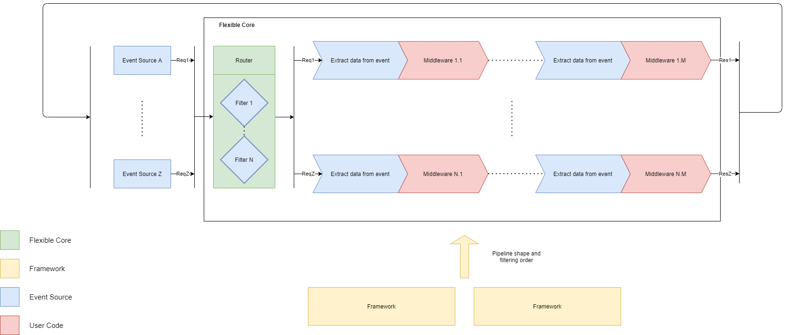

# Table of Contents

1. [Introduction](#flexible)
1. [Getting started](#getting-started)
1. [Available Frameworks and Event Sources](#available-frameworks-and-event-sources)
1. [Architecture](#architecture)
1. [How-tos](#how-tos)
    1. [How-to build an event source](#architecture)
    1. [How-to build a framework](#architecture)
    1. [How-to create your logger](#architecture)
    1. [How-to create your router](#architecture)
1. [FAQ](#architecture)
1. [Contacts](#architecture)
1. [Issues](#architecture)
1. [License](#architecture)


## Flexible

Flexible is a library that helps you build event processing pipelines by connecting Event Sources to Frameworks. Event Sources provide events
as javascript objects and flexible routes them through middleware structured according to the Frameworks of your choice.

## Getting started

To start using flexible you need to install flexible's core package, one or more event sources and one or more frameworks.

````
npm install flexible-core
npm install flexible-http #or any other
npm install flexible-decorators #or any other
````

Once that's done, you need to initialize your app and you are good to go!


`````
----------------------
./index.ts:
----------------------

const httpEventSource = HttpModuleBuilder.instance
    .build();

const decoratorsFramework = DecoratorsFrameworkModuleBuilder.instance
    .withControllerLoader(new ExplicitControllerLoader([
        HelloController
    ]))
    .build();

const application = FlexibleAppBuilder.instance
    .addEventSource(httpEventSource)
    .addFramework(decoratorsFramework)
    .createApp();

application.run().then(status => {
    console.log(JSON.stringify(status));
});

----------------------
./hello-controller.ts:
----------------------

@Controller({ filter: HttpMethod })
export class HelloController {

    @Route(HttpGet)
    public world(): any {
        return "hello world";
    }

}
`````

## Available Frameworks and Event Sources

### Frameworks

1. [flexible-decorators](https://github.com/ftacchini/flexible-decorators): a framework that uses typescript decorators to create controllers that shape your pipelines.
1. [flexible-dummy-framework](https://github.com/ftacchini/flexible-dummy-framework): a framework that helps you to easily create integration tests for newly created event sources.

### Event Sources

1. [flexible-http](https://github.com/ftacchini/flexible-http): an event source that allows you to feed and filter http and https events into pipelines.
1. [flexible-dummy-source](https://github.com/ftacchini/flexible-dummy-source): an event sources that helps you easily create integration tests for newly created frameworks.

## Architecture

A simplified schema of Flexible can be seen below:



- Flexible Core:
- Frameworks:
- Event Sources:
- User Code:

## Request Lifecycle Logging

Flexible includes built-in request lifecycle logging to help you track requests through your application. Each request is assigned a unique ID that follows it through the entire processing pipeline.

### Enabling Logging

```typescript
import { FlexibleAppBuilder, ConsoleLoggerModule } from "flexible-core";

const application = FlexibleAppBuilder.instance
    .withLogger(new ConsoleLoggerModule())  // Enable logging
    .addEventSource(httpEventSource)
    .addFramework(decoratorsFramework)
    .createApp();
```

### Request ID Format

Each request gets a unique ID in the format: `timestamp-counter-random`

Example: `1701234567890-1-a3f2`
- `1701234567890` - Unix timestamp in milliseconds
- `1` - Sequential counter
- `a3f2` - Random string

### X-Request-ID Header Support

If a client sends an `X-Request-ID` header, that ID will be used throughout the request lifecycle. Otherwise, a new ID is generated automatically.

```bash
curl -H "X-Request-ID: my-custom-id" http://localhost:8080/api
```

### Example Log Output

```
[1701234567890-1-a3f2] HTTP GET /world - Client: 127.0.0.1
[1701234567890-1-a3f2] Request received - Type: http
[1701234567890-1-a3f2] Routing request - Finding matching pipelines
[1701234567890-1-a3f2] Found 1 matching pipeline(s)
[1701234567890-1-a3f2] Processing pipeline 1/1
[1701234567890-1-a3f2] Handler completed in 12ms - 1 response(s)
[1701234567890-1-a3f2] Response sent - Status: 200
[1701234567890-1-a3f2] Request completed - 1 response(s) generated
```

### What's Logged

✅ **Safe metadata:**
- Request ID
- HTTP method and path
- Client IP address
- Status code
- Processing duration
- Pipeline count

❌ **NOT logged (security):**
- Request/response bodies
- Query parameters
- Headers
- Cookies or tokens
- Personal information

### Production Use

For production, use `SilentLoggerModule` to disable debug logs:

```typescript
const logger = process.env.NODE_ENV === 'production'
    ? new SilentLoggerModule()
    : new ConsoleLoggerModule();
```

For more details, see [LOG_FLOW_DIAGRAM.md](../LOG_FLOW_DIAGRAM.md) and [EXAMPLE_LOGS.md](../EXAMPLE_LOGS.md).

## Test Utilities

Flexible Core now includes test utilities (previously separate packages):

```typescript
import { DummyFramework, DummyEventSource } from "flexible-core";

// Use in tests
const framework = new DummyFramework();
framework.addPipelineDefinition({
  filterStack: [/* ... */],
  middlewareStack: [/* ... */]
});

const eventSource = new DummyEventSource();
await eventSource.run();
await eventSource.generateEvent(myEvent);
```

## How do I create an Event Source?

Event sources should implement the `FlexibleEventSource` interface:

```typescript
export interface FlexibleEventSource {
  run(): Promise<any>;
  stop(): Promise<any>;
  onEvent(handler: (event: FlexibleEvent) => Promise<any>): void;

  // Optional: for health checks
  healthCheck?(): Promise<HealthStatus>;
}
```

## How do I create a Framework?

Frameworks should implement the `FlexibleFramework` interface:

```typescript
export interface FlexibleFramework {
  readonly container: AsyncContainerModule;
  createPipelineDefinitions(): Promise<FlexiblePipelineDocument[]>;
}
```